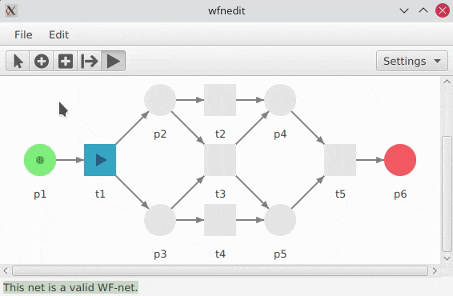

# wfnedit

wfnedit is a simple cross-platform GUI editor for [workflow nets](https://en.wikipedia.org/wiki/Petri_net#Workflow_nets).

## Compatibility

Should work everywhere as long as Java 8 is available. Tested under Archlinux and Windows 10.

## Usage

Java 8 or above is required.

### Prebuild JAR

A [prebuilt JAR](https://github.com/paulfedorow/wfnedit/releases) is available.

### Build from source

Execute the following commands to build wfnedit:

    git clone https://github.com/paulfedorow/wfnedit
    cd wfnedit
    mvn clean compile assembly:single

The resulting JAR is located in the directory ``target``.

### Run

Run the JAR file by double-click or with the following command:

    java -jar wfnedit-0.1-jar-with-dependencies.jar